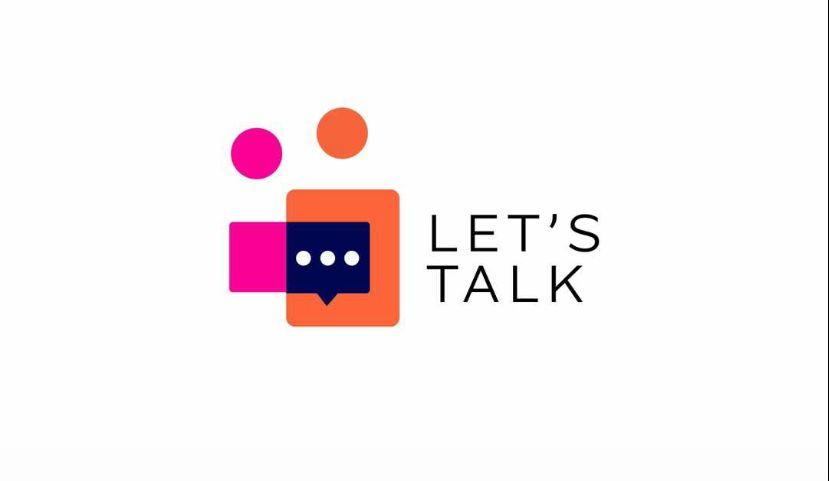

    

 

<!-- TABLE OF CONTENTS -->

# 📗 Table of Contents

- [📗 Table of Contents](#-table-of-contents)
- [📖 About ](#-about-)
  - [🛠 Built With ](#-built-with-)
    - [Tech Stack ](#tech-stack-)
    - [Key Features ](#key-features-)
    - [Rails Back End Application ](#rails-back-end-application-)
  - [💻 Getting Started ](#-getting-started-)
    - [Prerequisites](#prerequisites)
    - [Setup](#setup)
    - [Install](#install)
    - [Usage](#usage)
  - [👥 Author ](#-author-)
  - [🤝 Contributing ](#-contributing-)
  - [⭐️ Show your support ](#️-show-your-support-)
  - [🙏 Acknowledgments ](#-acknowledgments-)
  - [❓ FAQ (OPTIONAL) ](#-faq-optional-)
  - [📝 License ](#-license-)

<!-- PROJECT DESCRIPTION -->

# 📖 About 

**Let's Talk** is a blog and sport scores predicting app.

## 🛠 Built With 

### Tech Stack 

  
Laravel

  <ul>
    <li><a href="https://laravel.com/">Laravel</a></li>
  </ul>

<!-- Features -->

### Key Features 

- **JWT Authentication**

(<a href="#readme-top">back to top</a>)

<!-- GETTING STARTED -->

## 💻 Getting Started 

To get a local copy up and running, follow these steps.

### Prerequisites

In order to run this project you need:

- A good computer
- PHP
- An internet connection

### Setup

Clone this repository to your desired folder:

- git clone https://github.com/solobarine/lets_talk.git

### Install

- composer require

### Usage

To run the project, execute the following command:

- php artisan serve
- visit http://localhost:8000

(<a href="#readme-top">back to top</a>)

<!-- AUTHOR -->

## 👥 Author 

👤 **Solomon Barine**

- GitHub: [@solobarine](https://github.com/solobarine)

(<a href="#readme-top">back to top</a>)

<!-- CONTRIBUTING -->

## 🤝 Contributing 

Contributions, issues, and feature requests are welcome!

Feel free to check the [issues page](../../issues/).

(<a href="#readme-top">back to top</a>)

<!-- SUPPORT -->

## ⭐️ Show your support 

If you like this project feel free to fork it and use it as you need.

(<a href="#readme-top">back to top</a>)

<!-- FAQ (optional) -->

## ❓ FAQ (OPTIONAL) 

- **Will there be future updates?**

  - Certainly

(<a href="#readme-top">back to top</a>)

<!-- LICENSE -->

## 📝 License 

This project is [MIT](./LICENSE) licensed

(<a href="#readme-top">back to top</a>)

